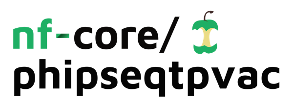

<h1>
  <picture>
    <source media="(prefers-color-scheme: dark)" srcset="docs/images/nf-core-phipseqtpvac_logo_dark.png">
    
  </picture>
</h1>


[](https://www.nextflow.io/)
[](https://docs.conda.io/en/latest/)
[](https://www.docker.com/)
[](https://sylabs.io/docs/)
[](https://tower.nf/launch?pipeline=https://github.com/nf-core/phipseqtpvac)

## Introduction

**nf-core/phipseqtpvac** is a bioinformatics pipeline designed to analyze Treponema pallidum PhiP-Seq assay data. It processes FASTQ files using a provided sample sheet, performing quality control (QC), trimming, and (pseudo-)alignment. The pipeline outputs a count matrix in CSV format, where rows represent features from the PhiP-Seq library and columns correspond to the input samples, providing a comprehensive quantification of feature counts across all samples.

1. Adapter and quality trimming ([`Cutadapt`](https://cutadapt.readthedocs.io/en/stable/))
2. Pseudoalignment and quantification ([`Kallisto`](https://pachterlab.github.io/kallisto/))
3. Aggregation of Kallisto quantifications into a unified count matrix (custom Python script)

## Usage

> [!NOTE]
> If you are new to Nextflow and nf-core, please refer to [this page](https://nf-co.re/docs/usage/installation) on how to set-up Nextflow. Make sure to [test your setup](https://nf-co.re/docs/usage/introduction#how-to-run-a-pipeline) with `-profile test` before running the workflow on actual data.

First, prepare a samplesheet with your input data that looks as follows:

`samplesheet.csv`:

```csv
sample,fastq_1,fastq_2
CONTROL_REP1,AEG588A1_S1_L002_R1_001.fastq.gz,AEG588A1_S1_L002_R2_001.fastq.gz
```

Each row corresponds to a single sample (one pull-down) with its associated pair of FASTQ files for paired-end sequencing.


Now, you can run the pipeline using:

<!-- TODO nf-core: update the following command to include all required parameters for a minimal example -->

```bash
nextflow run nf-core/phipseqtpvac \
   -profile <docker/singularity/.../institute> \
   --input samplesheet.csv \
   --outdir <OUTDIR>
```

> [!WARNING]
> Please provide pipeline parameters via the CLI or Nextflow `-params-file` option. Custom config files including those provided by the `-c` Nextflow option can be used to provide any configuration _**except for parameters**_;
> see [docs](https://nf-co.re/usage/configuration#custom-configuration-files).

For more details and further functionality, please refer to the [usage documentation](https://nf-co.re/phipseqtpvac/usage) and the [parameter documentation](https://nf-co.re/phipseqtpvac/parameters).

## Pipeline output

The pipeline generates separate output directories for results from Cutadapt, Kallisto, and the custom Kallisto output parsing program (`cutadapt_out`, `kallisto_out`, and `parsed_raw_counts`, respectively). Each directory contains the relevant quality control, trimming, or quantification files. Additionally, a unified count matrix (`kallisto_raw_counts_merged.csv`) is produced, summarizing feature counts across all input samples.

## Credits

nf-core/phipseqtpvac was originally written by [@DariiaVyshenska](https://github.com/DariiaVyshenska).

We thank the following people for their extensive assistance in the development of this pipeline: Thaddeus Armstrong, Ben Wieland, Alex Greninger.


## Contributions and Support

If you’re interested in contributing to this pipeline, please reach out to the repository owner.

## Citations

<!-- If you use nf-core/phipseqtpvac for your analysis, please cite it using the following doi: [10.5281/zenodo.XXXXXX](https://doi.org/10.5281/zenodo.XXXXXX) -->

An extensive list of references for the tools used by the pipeline can be found in the [`CITATIONS.md`](CITATIONS.md) file.

You can cite the `nf-core` publication as follows:

> **The nf-core framework for community-curated bioinformatics pipelines.**
>
> Philip Ewels, Alexander Peltzer, Sven Fillinger, Harshil Patel, Johannes Alneberg, Andreas Wilm, Maxime Ulysse Garcia, Paolo Di Tommaso & Sven Nahnsen.
>
> _Nat Biotechnol._ 2020 Feb 13. doi: [10.1038/s41587-020-0439-x](https://dx.doi.org/10.1038/s41587-020-0439-x).
